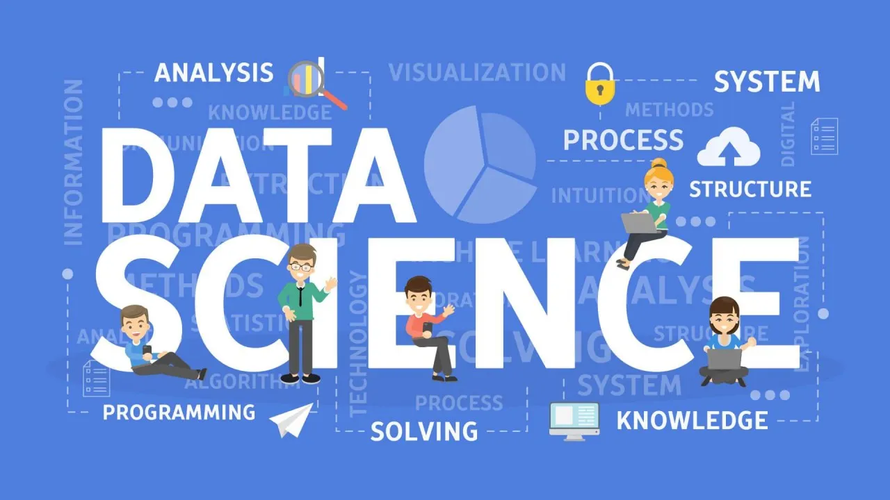

# Data Science for Mathematicians
วิทยาการข้อมูลสำหรับนักคณิตศาสตร์

ผู้สอน: ดร.รัฐพรหม พรหมคำ




## ปีการศึกษา 2566/2
รายวิชานี้ดำเนินการสอนในรูปแบบการบรรยาย ปฏิบัติการทางคอมพิวเตอร์ 
อาจรวมถึงห้องเรียนออนไลน์หรือเป็นไปตามประกาศของทางมหาวิทยาลัยเทคโนโลยีราชมงคลธัญบุรี 


### เวลาและสถานที่เรียน

| Section | ห้องเรียน | วัน | บรรยายทฤษฏี  | ปฏิบัติการ  |
|--------|---------|----|---------------|---------------|
| 01     |  ST1905 | พฤหัสบดี | 08.00 - 10.00  | 10.00 - 12.00|

สอบกลางภาค:  22 มกราคม 2567 เวลา 13.00 - 16.00

สอบปลายภาค:  20 มีนาคม 2567 เวลา 13.00 - 16.00

### ห้องเรียนออนไลน์ Microsoft Teams

| Section | Invitation Code | 
|---------|-----------------|
|     01  |  `ufuwjjs`      | 

กรอกรหัสการเข้าร่วม (Invitation Code) ตามที่ระบุไว้ของแต่ละ Section ที่นักศึกษาได้ลงทะเบียนไว้ เพื่อเข้าใช้งานห้องเรียนออนไลน์


## คำอธิบายรายวิชา
หลักปฏิบัติเบื้องต้นของวิทยาการข้อมูล การสร้างแบบจำลองของการทำนาย การแบ่งส่วนแบบมีผู้สอน ฟังก์ชันดิสคริมิแนนต์ การวิเคราะห์การปฏิบัติงานของแบบจำลอง การคิดเชิงวิเคราะห์สำหรับการตัดสินใจ การแสดงภาพการปฏิบัติงานของแบบจำลอง การทำนายโดยใช้การรวมหลายหลักฐาน การทำเหมืองและแทนข้อความอักษร ความคล้ายคลึงและเพื่อนบ้านที่ใกล้ที่สุด การจัดกลุ่มและทำเหมืองข้อมูลแบบไม่มีผู้สอน และปฏิบัติการที่เกี่ยวข้อง
          
Introduction to the practice of data science, predictive modeling, supervised segmentation, discriminant functions, model performance analytics, decision analytic thinking, model performance visualization, prediction via evidence combination, mining and text representation, similarity and nearest neighbors, unsupervised clustering and data mining and related laboratory


## จุดมุ่งหมายรายวิชา

1. ปฏิบัติตามกฎ ระเบียบ ข้อบังคับ และข้อตกลงของชั้นเรียนได้ 
2. อธิบายวิธีการนำเข้าข้อมูลได้ 
3. จำแนกประเภทของข้อมูลได้ 
4. อธิบายกระบวนการในการจัดการชุดข้อมูล การจัดเตรียมข้อมูล การคัดกรอง การสุ่มตัวอย่าง การประมวลผลข้อมูลขนาดใหญ่ และการสำรวจข้อมูลได้ 
5. ประยุกต์ใช้การทำนายและการจำแนกด้วยวิธีการทางคณิตศาสตร์ และแปลผลได้ 
6. สร้างแผนภาพจากชุดข้อมูลเพื่อการนำเสนอได้ 
7. นำเสนอข้อมูลทางคณิตศาสตร์ได้ 


## หัวข้อการบรรยาย

1. PART A: Data Science Fundamental
1. PART B: Applied Data Science with Python
1. PART C: Data Science for Business
1. PART D: Projects

|PART| Topic						| 	Class Materials 		|
|----|---------------------------|---------------------------|
| A  | Introduction to data science  | [Lecture](./materials/01_data_science_intro.pdf)/ [Workshop](./materials/workshop_01.zip) |
| A  | Data Science Tools  | [Lecture](./materials/lecture_02.pdf)/ [Workshop](./materials/workshop_02.zip) |
| A  | Data Science Methodology  | [Lecture](./materials/lecture_03.pdf)/ [Workshop](./materials/workshop_03.zip) |
| B  | Data Visualization with Python  | [Lecture](./materials/lecture_04.pdf)/ [Workshop](./materials/workshop_04.zip) |
|    | MID-TERM Examination  |  |
| B  | Data Analysis with Python   | [Lecture](./materials/lecture_05.pdf)/ [Workshop](./materials/workshop_05.zip) |
| B  | Machine Learning with Python    | [Lecture](./materials/lecture_06.pdf)/ [Workshop](./materials/workshop_06.zip) |
| C  | Data Privacy Fundamentals    | [Lecture](./materials/lecture_07.pdf)/ [Workshop](./materials/workshop_07.zip) |
| C  | Predictive Modeling Fundamentals    | [Lecture](./materials/lecture_08.pdf)/ [Workshop](./materials/workshop_08.zip) |
| C  | Case study I  | TBA  |
| C  | Case study II | TBA  |
| D  | Project-based Seminar I | TBA  |
| D  | Project-based Seminar II | TBA  |
| D  | Project-based Seminar III | TBA  |
|    | FINAL Examination  |  |


## การวัดผลการเรียน
คะแนนเต็ม 100 คะแนน โดยแบ่งออกเป็น
- การสอบกลางภาค 25%
- การสอบปลายภาค 25%
- งานที่ได้รับมอบหมาย 25%
- โครงงาน 25%

หากนักศึกษาเข้าเรียนน้อยกว่า 80% ของเวลาเรียนทั้งหมด
หรือได้คะแนนรวมน้อยกว่า 50% ของคะแนนเต็ม นักศึกษาจะไม่ผ่านในรายวิชานี้ และได้รับการบันทึกผลการเรียน F (เกรด 0.0) 

สำหรับนักศึกษาที่ผ่านเกณฑ์ดังกล่าว จะได้รับการบันทึกผลการเรียนตามเกณฑ์ของคะแนน t-score 

```
t-score = 50 + 10*(x - u)/s
```
เมื่อ x คือคะแนนรวม, u คือคะแนนเฉลี่ยของคะแนนรวม และ s คือส่วนเบี่ยงเบนมาตรฐานของคะแนนรวม

ดังนี้

| ผลการเรียน | เกรด | เกณฑ์ t-score |
|---------|------|--------------|
| F | 0.00 | (-Inf, 50) | 
| D | 1.00 | [50, 55) | 
| D+ | 1.50 | [55, 60) | 
| C | 2.00 | [60, 65) |
| C+ | 2.50 | [65, 70) |
| B | 3.00 | [70, 75) |
| B+ | 3.50 | [75, 80) |
| A | 4.00 | [80, Inf) |


## เอกสารอ้างอิง
- W. McKinney, Python for Data Analysis: Data Wrangling with Pandas, NumPy, and IPython, 2nd edition. O’Reilly Media, 2017.	
- B. Tuckfield, Dive Into Data Science: Use Python To Tackle Your Toughest Business Challenges. San Francisco, CA: No Starch Press, 2023.	
- J. Grus, Data Science from Scratch: First Principles with Python, 2nd edition. Sebastopol, CA: O’Reilly Media, 2019.	
